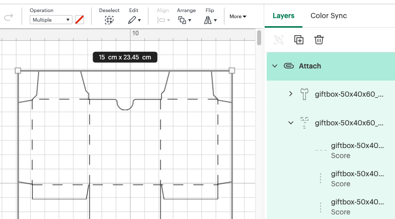

We are about to make a simple cardboard box. Instead of designing the box from scratch, we will use a template. If you would like to create your own designs in the future: make sure you draw the cutting and embossing lines on a different layer. As always, you need a [vector file](../../general/01-preparation.md).

:::note
If this is the first time you are using the Cricut, make sure you have read the [Getting started](../..) section.
:::

## Design it

- Download a Gift Box template from [templatemaker](https://www.templatemaker.nl/en/giftbox/). You can tweak a lot of parameters over there, but the most important one now is the Page Size, which should be set to A4. Download it as a `Cricut` file. Note that this is a stripped down `.svg` file.

## Setup

- Upload the svg to the [Cricut Design Space](https://design.cricut.com/). You can do this by clicking on the 'Upload' button in the left menu.
- You should see 2 grouped layers, right click on the group and select 'Ungroup'.
- Select the first layer and select 'basic cut' in the operation menu on the top left
- Select the second layer and select 'score' in the operation menu on the top left
- Select both layers and click on 'attach' at the bottom of the layers panel. Doing so will prevent that the Cricut tries to optimize te positioning of all the separate parts. Resulting in a totally different design.

## Make it

- Click on 'Make' in the top right corner to start the cutting process
- Check the drawing, does it look like you expected?
- Select the mat size. 30.5x30.5cm is the default one.
- Click on 'Continue'

## Cutting

- Select the desired material. We had good results by selecting 300gsm paper for the 200gsm paper we have for the copier. There is also a 'Cereal box' option, a perfect choice if you are using that type of cardboard.
- Now follow the steps on the screen. Load in the mat and paper, press the flashing button and let the Cricut do its job. You will have to switch the scoring tool for the cutting tool at some point. The Cricut will tell you when to do so.
