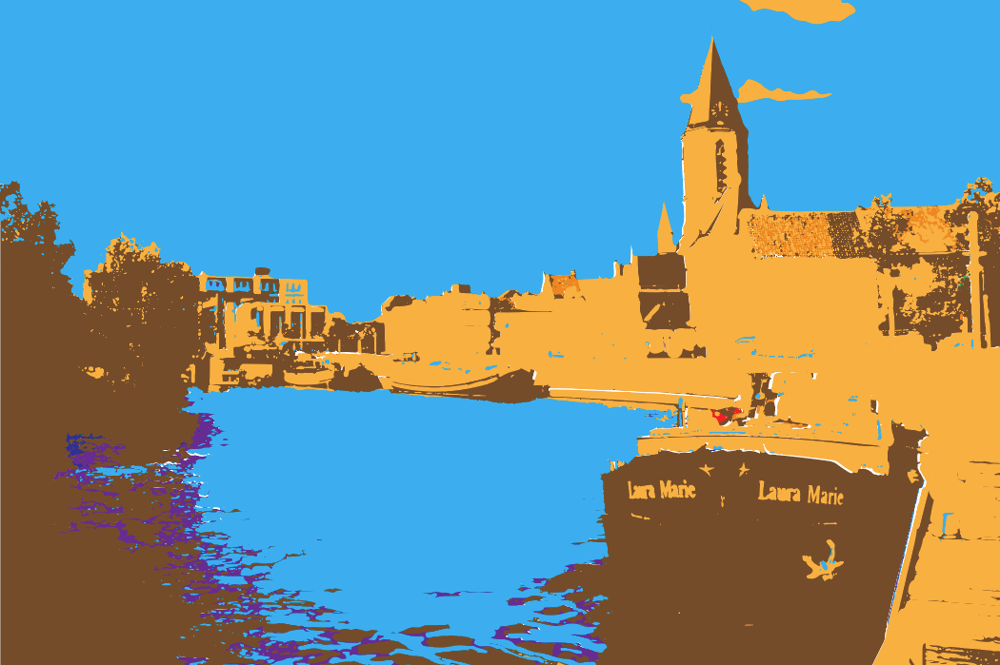
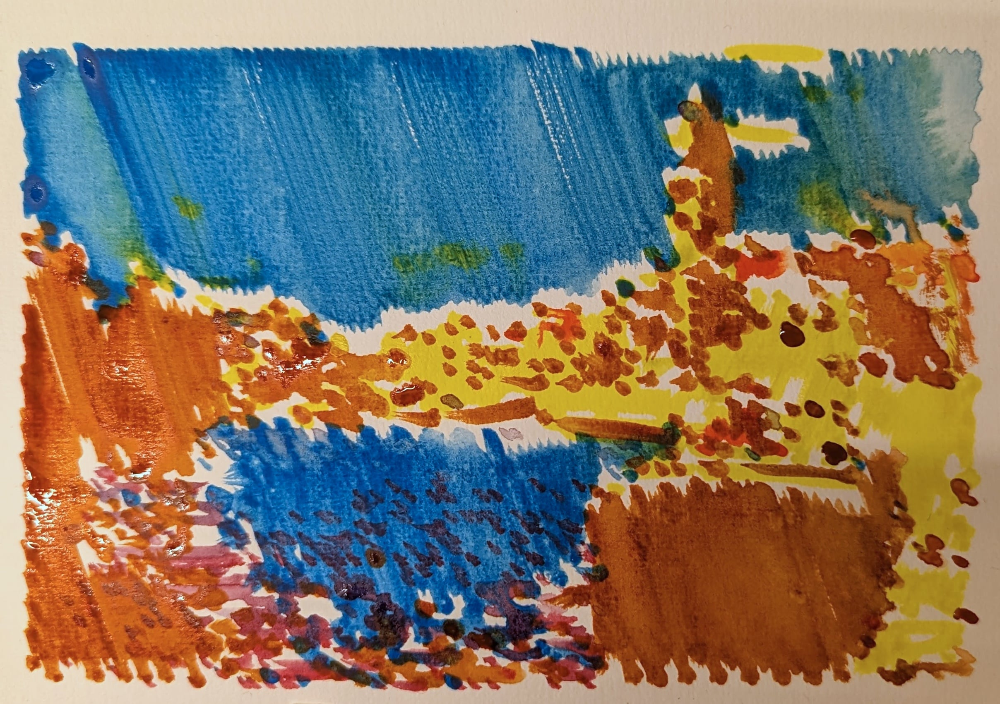

## 05/03/2024

- So we tried to paint Deize, it kind of worked, but we need to work on the settings.
 
 

  This is the [Vpype script](../general/03-vpype) used to generate the paint file.

  ```bash
  vpype \
   read deinze-hatch-fill.svg \
   forlayer \
    lmove %_lid% 1 \
   splitall \
    splitdist 10cm \
   linemerge \
    forlayer \
    lmove %_lid% "%_lid*2%" \
    read -l "%_lid*2-1%" dip_water.svg \
    read -l "%_lid*2-1%" dip_%_name%.svg \
    end \
   lmove all %_lid% \
   name -l %_lid% %_name% \
   color -l %_lid% %_color% \
   end \
   write deinze-output.svg
  ```

- Some logo's were embroided in the meantime.

## 20/02/2024

- Welcome in our new space, the Tech Tile Temple
- You can make use of this area [whenever you want](../temple)
- Tried to create a map of Deinze to embroider, but the file was too big for Inkscape to handle.

## 06/11/2023

- Multi pass with a Sakura White Gelly Roll pen on black paper in honour of [Plot party](https://penplotterartwork.com/plotparty/)
- Chameleon changing color markers: <https://www.chameleonart.com>

## 23/10/2023

- Little embroidery demo
- A closer look at [@pavlovpulus](https://www.instagram.com/p/CyURVcqL3Zv/) his work

## 02/10/2023

- When it's Tech Tile Time, please limit your plots to 10-15min
- [ttt.devine.be](https://ttt.devine.be) is the shortcut ;-)
- Helmut Plotti is still down, sorry
- A couple of plots/exercises to get you started were added tot the site.
  - [Self-portrait](../plotter/Try%20it%20yourself/01-selfportrait.md)
  - [Map poster](../plotter/Try%20it%20yourself/02-mapposter.md)
- drawing prompts
  - [Inktober](https://inktober.com/rules)
  - [6-11 November Plot Party](https://penplotterartwork.com/plotparty/)
- Discovered [DrawingBotV3](https://github.com/SonarSonic/DrawingBotV3/) an (impressive) free tool to convert images to vector files
- It would be nice to have an explanation how to export SVG's from p5.js.

## 18/09/2023

- Welcome :-)
- Helmut Plotti is down, but you can connect directly to the mini plotter via USB
- [Spiral Betty](https://spiralbetty.com/) was brought to our attention.
