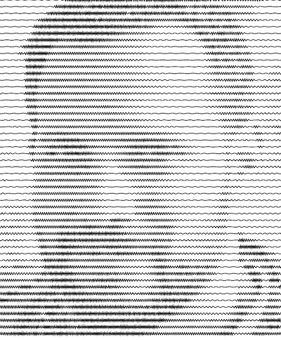

## Steps

1. Choose a picture of yourself
2. Go to [Plotterfun](https://mitxela.com/plotterfun/) and upload your picture there.
3. Pick an alorithm and tweak the parameters until you're happy with the result.
4. Download the SVG file
5. Follow the steps described in the [Webinterface](../../01-webinterface) to plot the file.
