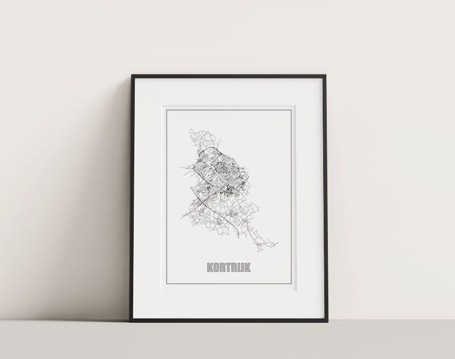

## Prerequisites

- You have a working installation of [InkScape and the AxiDraw extension](../../02-inkscape)

## Steps

1. Go to [City roads](https://anvaka.github.io/city-roads/) and enter the name of your hometown
2. Zoom in or out, depending on the level of detail you want
3. Click 'Customize' and save 'as a vector (.svg)'
4. Open the file in Inkscape
5. Choose 'File' > 'Document Properties' and select the document size you want. Don't forget the orientation.
6. Click somewhere on the map where there are no roads to select the backgrond. Remove this by pressing the delete key.
7. Select the whole map, scale and position it as needed.
8. Pick the text tool and write down the name of your hometown. Place it at the bottom, make it big and bold.
9. Select only the text now.
10. Choose 'Path' > 'Object to path' to convert the text to a path (outlines)
11. Zoom in a bit, so you get a good overview of the text
12. In the 'Fill and Stroke' panel, choose 'Stroke paint' > 'Flat color' and pick a color (black is fine)
13. Still in the 'Fill and Stroke' panel, choose 'Fill' > 'No paint' (the "x" icon)
14. With the text outlines still sected, choose 'extensions' > 'AxiDraw utilities' > 'Hatch fill...'
15. Check the 'Live preview' box at the bottom
16. Adjust the settings until you get the density you want. Have the thickniss of actual pen in mind when you set the 'Hatch spacing'. An angle of 45° turns out nice.
17. Click 'Apply' and 'Close'
18. As a finishing touch, add two rectangles around the poster, as a kind of frame. Set them 1-2 mm apart for a classic look.
19. Save the file as an SVG
20. Follow the steps described in the [Webinterface](../01-webinterface.md) to plot the file.
